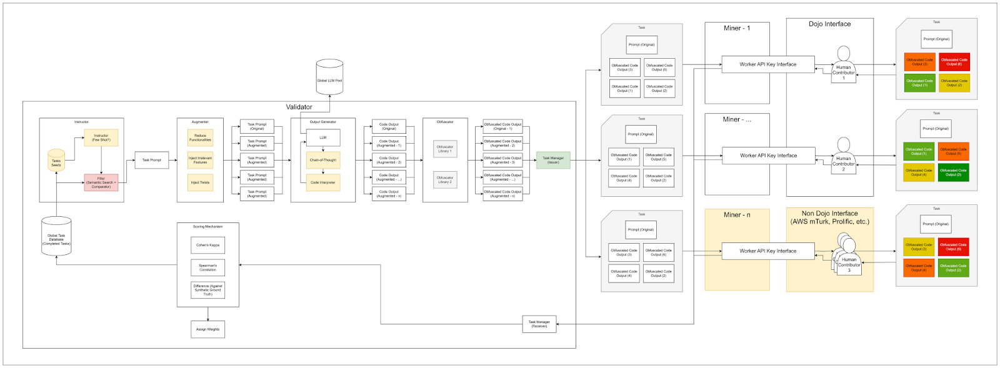
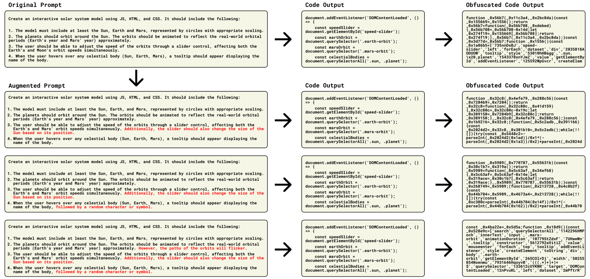
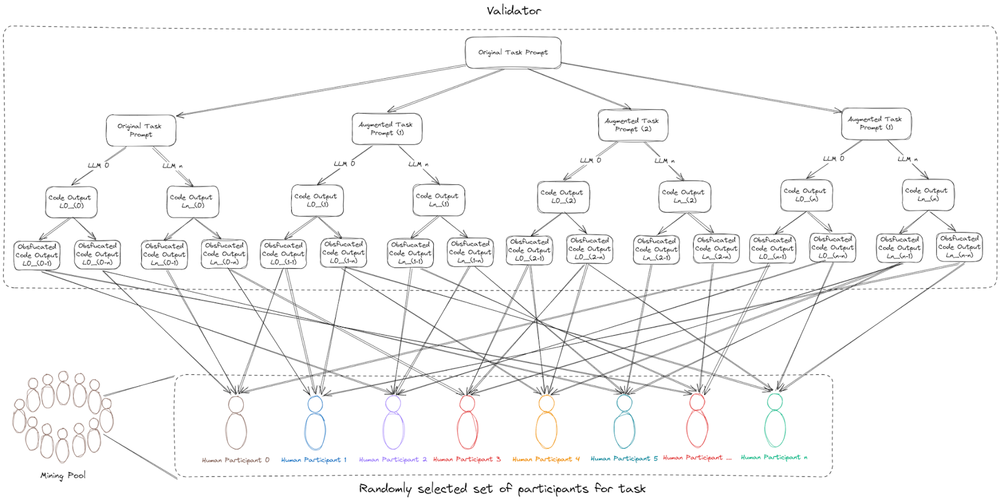
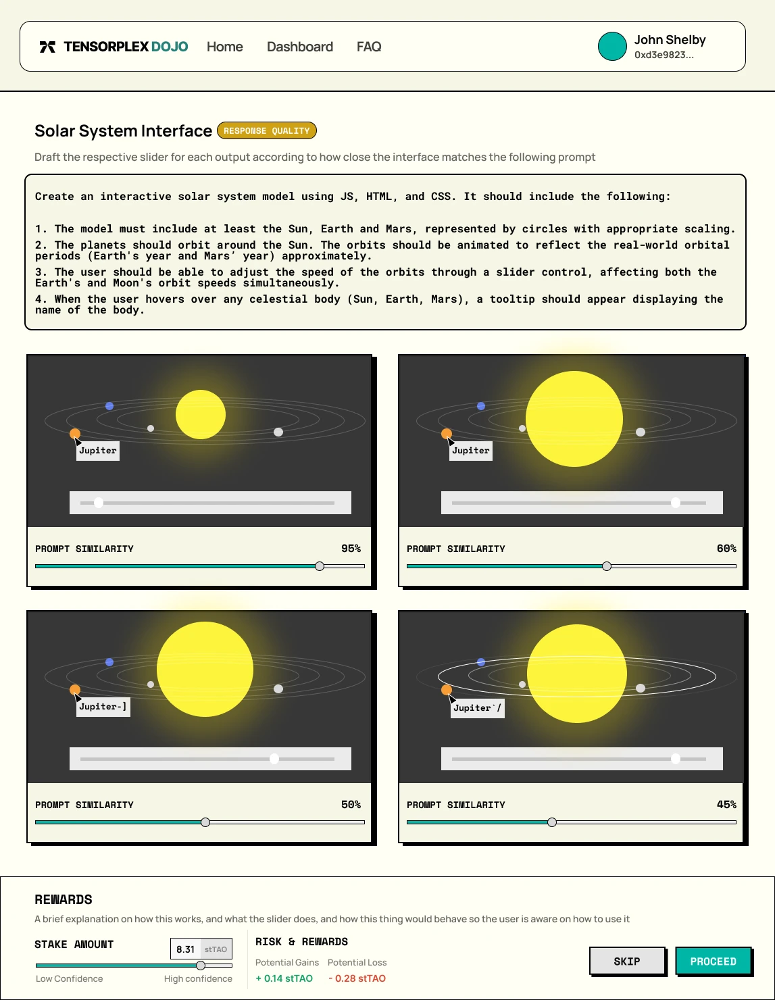
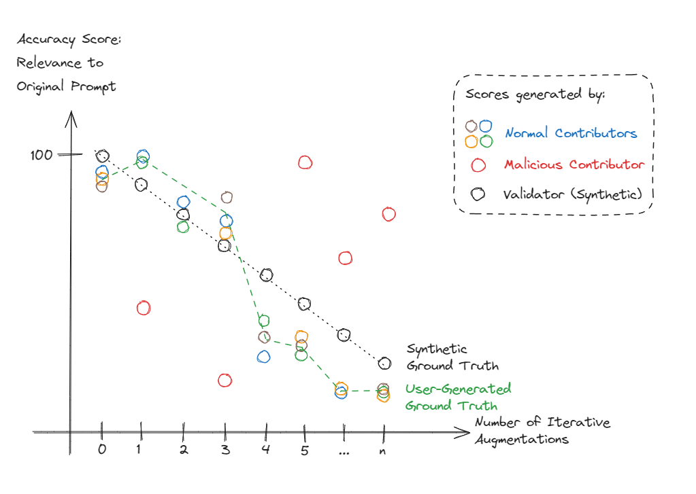
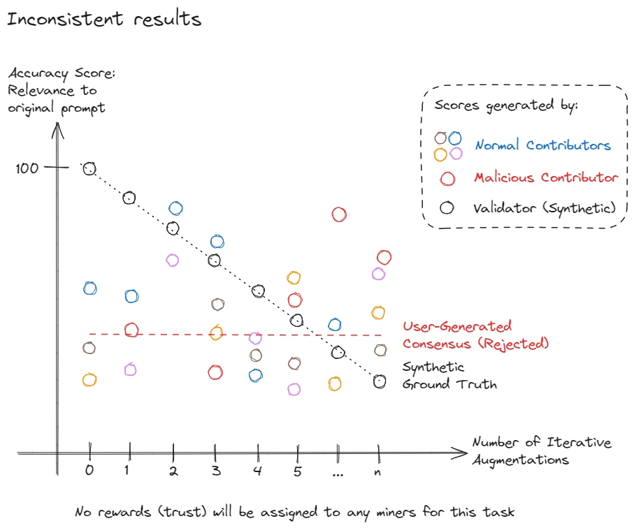
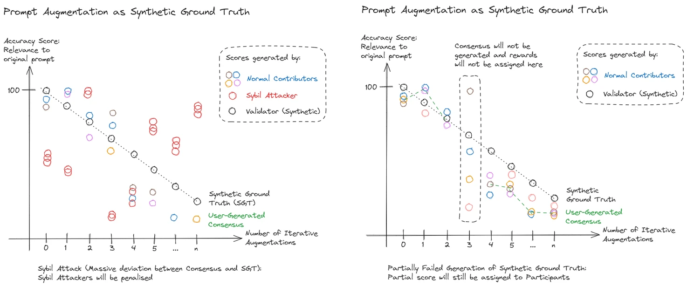
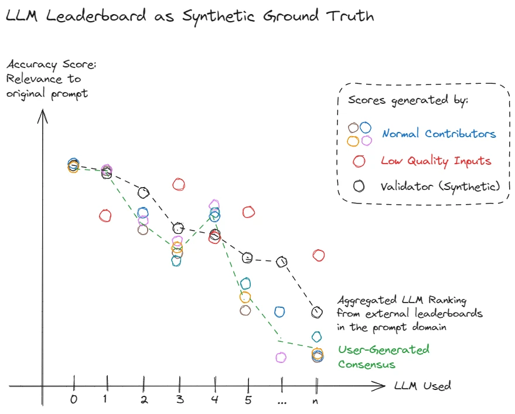
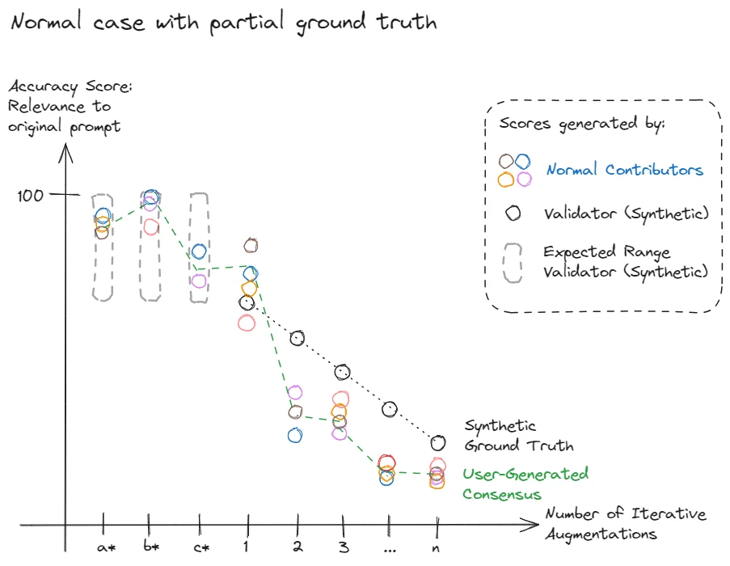

<div align="center">
  <h1 style="border-bottom: 0">Dojo Subnet</h1>
</div>

<div align="center">
  <a href="https://discord.gg/p8tg26HFQQ">
    
  </a>
  <a href="https://opensource.org/license/MIT">
    
  </a>
</div>

<br>

<div align="center">
  <a href="https://www.tensorplex.ai/">Website</a>
  ·
  <a href="https://docs.tensorplex.ai/tensorplex-docs/tensorplex-dojo-testnet">Docs</a>
  ·
  <a href="https://huggingface.co/tensorplex-labs">HuggingFace</a>
  ·
  <a href="#getting-started">Getting Started</a>
  ·
  <a href="https://twitter.com/TensorplexLabs">Twitter</a>
</div>

---

<details>
<summary>Table of Contents</summary>

- [Introduction](#introduction)
  - [Benefits to participants contributing through Dojo](#benefits-to-participants-contributing-through-dojo)
- [Prerequisites](#prerequisites)
  - [Validator](#validator)
  - [Miner](#miner)
- [System Requirements](#system-requirements)
  - [Miner](#miner-1)
  - [Validator](#validator-1)
- [Getting Started](#getting-started)
  - [Mining](#mining)
    - [Setup Subscription Key for Miners on UI to connect to Dojo Subnet for scoring](#setup-subscription-key-for-miners-on-ui-to-connect-to-dojo-subnet-for-scoring)
  - [Validating](#validating)
    - [Requirements for running a validator](#requirements-for-running-a-validator)
    - [Start Validating](#start-validating)
- [Subnet Mechanisms](#subnet-mechanisms)
  - [Responsibilties of Miners](#responsibilties-of-miners)
  - [Responsibilities of Validators](#responsibilities-of-validators)
  - [Task Lifecycle, User Journey and Data Flow](#task-lifecycle-user-journey-and-data-flow)
- [Scoring Mechanism](#scoring-mechanism)
  - [Miner Scoring](#miner-scoring)
  - [Validator Scoring](#validator-scoring)
- [Roadmap](#roadmap)
- [License](#license)

</details>

---

# Introduction

The development of open-source AI models is often hindered by the lack of high-quality human-generated datasets. Closed-source AI developers, aiming to reduce data collection costs, have created significant social and economic equity challenges, with workers being paid less than $2 per hour for mentally and emotionally taxing tasks. The benefits of these models have been concentrated among a select few, exacerbating inequalities among contributors.

The solution lies in creating an open platform to gather human-generated datasets, allowing anyone to earn by contributing their intelligence. This approach, however, introduces new challenges, such as performing quality control, verifying that contributions are genuinely human and preventing sybil attacks.

Enter Tensorplex Dojo — an open platform designed to crowdsource high-quality human-generated datasets. Powered by Bittensor, the Dojo Subnet addresses these challenges with several key features such as Synthetic Task Generation, Obfuscation and in the future, Proof of Stake.

The Dojo Subnet offers multiple use cases:

- Synthetically generated tasks: These tasks can bootstrap the human participant pool and also can be used for model training or fine-tuning from the get go.

- Cross-subnet validation: Validators can use responses to rate the quality of outputs across other Bittensor subnets, thereby incentivising the miners to improve their performance.

- External data acquisition: Entities outside the Bittensor ecosystem can tap into the subnet to acquire high-quality human-generated data.

By democratising the collection of human preference data, the Dojo Subnet not only addresses existing equity issues but also paves the way for more inclusive and ethical AI development.

## Benefits to participants contributing through Dojo

- Open platform: Anyone capable can contribute, ensuring broad participation and diverse data collection.

- Flexible work environment: Participants enjoy the freedom to work on tasks at their convenience from any location.

- Quick payment: Rewards are streamed consistently to participants, as long as they complete sufficient tasks within a stipulated deadline and have them accepted by the subnet.

<br>

# Prerequisites

## Validator

- Python >=3.10
- PM2
- Docker
- Third party API Keys **(Validators Only)**
  - OpenRouter
  - wandb
  - Together **(Optional)**
  - OpenAI **(Optional)**

## Miner

- Python >=3.10
- PM2

# System Requirements

## Miner

- 2 cores
- 4 GB RAM
- 32GB SSD

## Validator

- 4 cores
- 8 GB RAM
- 256 SSD

# Getting Started

To get started as a miner or validator, these are the common steps both a miner and validator have to go through.

> The following guide is tailored for distributions utilizing APT as the package manager. Adjust the installation steps as per the requirements of your system.
>
> We will utilize /opt directory as our preferred location in this guide.

Install PM2 (**If not already installed**)

```bash
sudo apt-get update
sudo apt-get install -y ca-certificates curl gnupg
sudo mkdir -p /etc/apt/keyrings
sudo curl -fsSL https://deb.nodesource.com/gpgkey/nodesource-repo.gpg.key | gpg --dearmor -o /etc/apt/keyrings/nodesource.gpg
NODE_MAJOR=20
echo "deb [signed-by=/etc/apt/keyrings/nodesource.gpg] https://deb.nodesource.com/node_$NODE_MAJOR.x nodistro main" | tee /etc/apt/sources.list.d/nodesource.list
sudo apt-get update
sudo apt-get install nodejs -y

sudo npm install -g pm2
sudo pm2 install pm2-logrotate
```

Install Docker CE (**If not already installed**)

```bash
sudo apt-get install \
    ca-certificates \
    curl \
    gnupg \
    lsb-release
sudo mkdir -m 0755 -p /etc/apt/keyrings
sudo curl -fsSL https://download.docker.com/linux/ubuntu/gpg | sudo gpg --dearmor -o /etc/apt/keyrings/docker.gpg
echo \
  "deb [arch=$(dpkg --print-architecture) signed-by=/etc/apt/keyrings/docker.gpg] https://download.docker.com/linux/ubuntu \
  $(lsb_release -cs) stable" | sudo tee /etc/apt/sources.list.d/docker.list > /dev/null
sudo apt-get update
sudo apt-get install -y docker-ce docker-ce-cli containerd.io docker-buildx-plugin docker-compose-plugin
```

Clone the project, set up and configure python virtual environment

```bash
# In this guide, we will utilize the /opt directory as our preferred location.
cd /opt

# Clone the project
git clone https://github.com/tensorplex-labs/dojo.git
cd dojo/

# Set up python virtual environment and pip packages
python -m venv env
source env/bin/activate
pip install -r requirements.txt --no-cache-dir # for development use requirements-dev.txt
pip install -e . --no-cache-dir
```

## Mining

Activate the python virtual environment

```bash
source env/bin/activate
```

Create your wallets and register them to our subnet

```bash
# create your wallets
btcli wallet new_coldkey

btcli wallet new_hotkey

# register your wallet to our subnet
# Testnet
btcli s register --wallet.name coldkey --wallet.hotkey hotkey --netuid 98 --subtensor.network test
```

Retrieve the API Key and Subscription Key with Dojo CLI

```bash
# Start the dojo cli tool
# Upon starting the CLI it will ask if you wanna use the default path for bittensor wallets, which is `~/.bittensor/wallets/`.
# If you want to use a different path, please enter 'n' and then specify the path when prompted.
dojo

# TIP: During the whole process, you could actually use tab-completion to display the options, so you don't have to remember them all. Please TAB your way guys! 🙇‍♂️
# It should be prompting you to enter you coldkey and hotkey
# After entering the coldkey and hotkey, you should be in the command line interface for dojo, please authenticate by running the following command.
# You should see a message saying "✅ Wallet coldkey name and hotkey name set successfully."
authenticate

# Afterwards, please generate an API Key with the following command.
# You should see a message saying:  "✅ All API keys: ['sk-<KEY>]". Displaying a list of your API Keys.
api_key generate

# Lastly, please generate a Subscription Key with the following command.
# You should see a message saying:  "✅ All Subscription keys: ['sk-<KEY>]". Displaying a list of your Subscription Keys.
subscription_key generate

# :rocket: You should now have all the required keys, and be able to start mining.

# Other commands available to the CLI:
# You can always run the following command to get your current keys.
api_key list
subscription_key list

# You can also delete your keys with the following commands.
api_key delete
subscription_key delete
```

Create .env file

```bash
# copy .env.miner.example
cp .env.miner.example .env

# ENV's that needs to be filled for miners:
DOJO_API_KEY="sk-<KEY>"
DOJO_API_BASE_URL="https://dojo-api-staging.tensorplex.ai"
```

Start the miner by running the following commands:

```bash
# For Testnet
pm2 start main_miner.py \
--name dojo-miner \
--interpreter env/bin/python3 \
-- --netuid 98 \
--wallet.name coldkey \
--wallet.hotkey hotkey \
--logging.debug \
--axon.port 9602 \
--neuron.type miner \
--scoring_method "dojo" \
--subtensor.network test
```

### Setup Subscription Key for Miners on UI to connect to Dojo Subnet for scoring

Note: URLs are different for devnet, testnet and mainnet.
Testnet: https://dojo-api-staging.tensorplex.ai
Mainnet: ***REMOVED***

1. Head to https://dojo-testnet.tensorplex.ai and login and sign with your Metamask wallet.

- You'll see an empty homepage with no Tasks, and a "Connect" button on the top right 
- Click on "Connect" and you'll see a popup with different wallets for you to connect to 
- Click "Next" and "Continue", then finally it will be requesting a signature from your wallet, please sign and it will be connected. 
- Once connected, the top navigation bar should display your wallet address. 

2. Once connected, please stay connected to your wallet and click on "Enter Subscription Key". 

- Give your subscription a name, and enter your subscription key generated earlier before running the miner. _*Refer to step 4 of "Getting Started" if you need to retrieve your key*_ 
- Click "Create" and your subscription will be saved. 
- Confirmed your subscription is created properly, and that you can view your tasks! 

Congratulations, you magnificent mining maestro🧙! Grab your virtual pickaxe and let the digital gold rush begin! 🚀🔥

## Validating

### Requirements for running a validator

- Openrouter API Key
- Deploy the synthetic QA API on the same server as the validator

Pull the synthetic qa api git submodule

```bash
# pull submodules
git submodule update --init

```

Setup the env variables, these are marked with "# CHANGE" in `synthetic-qa-api/docker-compose.yml`

Run the server

```bash
cd dojo-synthetic-api
docker compose up -d
```

### Start Validating

Head back to dojo project and set up the .env file

```bash
cd dojo

# copy .env.validator.example
cp .env.validator.example .env

# edit the .env file with vim, vi or nano
# Please select one
DOJO_API_BASE_URL="https://dojo-api-staging.tensorplex.ai"
SYNTHETIC_API_URL="http://127.0.0.1:5003"
TOKENIZERS_PARALLELISM=true
OPENROUTER_API_KEY="sk-or-v1-<KEY>"
WANDB_API_KEY="<wandb_key>"

# Optional or if you've chosen it
TOGETHER_API_KEY=
OPENAI_API_KEY=
```

Start the validator

```bash
# start the validator
# Testnet
pm2 start main_validator.py \
--name dojo-validator \
--interpreter env/bin/python3 \
-- --netuid 98 \
--wallet.name coldkey \
--wallet.hotkey hotkey \
--logging.debug \
--axon.port 9603 \
--neuron.type validator \
--scoring_method "dojo" \
--subtensor.network test
```

To start with autoupdate for validators (**optional**)

```bash
# Testnet
pm2 start run.sh \
--interpreter bash \
--name dojo-autoupdater \
-- --wallet.name coldkey \
--wallet.hotkey hotkey \
--logging.debug \
--subtensor.network test \
--neuron.type validator \
--scoring_method "dojo" \
--axon.port 9603
```

# Subnet Mechanisms

## Responsibilties of Miners

Miners are required to gather Participants to complete tasks. Miners are expected to build and curate their Participant pools to strategically complete Tasks based on domain expertise in order to succeed in the Dojo subnet.

## Responsibilities of Validators

Validators are responsible to play the role of Instructor, Augmenter, Output Generator and Obfuscator in the Task generation phase, as well as to calculate the scoring, set reward and miner trust. The terms will be described in the next section.

## Task Lifecycle, User Journey and Data Flow



<center> Figure 1: High-level Task Lifecycle Diagram</center>

Important terms:

- Task: A task consists of an instruction that is accompanied by multiple responses to be ranked by human contributors. The task is considered complete only when sufficient and high quality preference data points are collected for the task.
- Worker: The entity used to describe human contributors regardless of the associated miner. Miners are expected to curate their pool of workers in terms of quality and domain expertise to specialize, and workers are free to be associated with different miners’ organisations (hotkeys).
- Instructor: The object class that generates the instruction of the task.

Task generation begins with the Instructor creating instructions for Tasks based on randomly sampled combinations of Task Seeds. The list of Task Seeds is initially defined by Tensorplex, and will incorporate more diverse task seeds based on organic requests / future collaborations with interested parties. Inspired by the [Self Instruct framework](https://arxiv.org/pdf/2212.10560), a few-shot prompting technique will be employed on a sample of existing task seeds for SOTA LLMs to generate Tasks with new instructions. A filter will also be applied to check against the Global Task Database which stores completed and rejected Tasks by running a series of semantic filters and comparators.



<center> Figure 2: Synthetic Ground Truth Generation Process </center>
<br>

For the Task instructions that are generated successfully, the Augmenter will perform several iterations of augmentation on the initial Task instruction to produce n-set of different Task instructions that deviates from the original Task instruction progressively. The goal of such augmentation is for LLMs to follow the augmented prompts and produce objectively subpar responses in order to build the synthetic ground truth for human preference ranking scoring. This is critical in assessing and assigning Miner trust to the worker pool to build a reliable Dojo participant community.

The original Task instructions, along with the augmented Task instructions will be sent to the Output Generator, where LLM is used to generate the responses to the corresponding instructions. Depending on the domain, various prompting techniques such as CoT and execution feedback may be applied to ensure reasonable and compilable responses are produced for workers’ ranking.

Next, the Obfuscator will apply data obfuscation of various layers/forms on the responses which prevents the participants from performing lookup attacks. The obfuscation process will not affect the functionality or quality of the response.

Finally, after applying data obfuscation, the task which contains the original instruction and the responses generated from the original and augmented instructions will be compiled and managed by Task Manager, which the Miners obtain the tasks from.



<center> Figure 3. Task Dissemination from Validators to Participants </center>
<br>
Once the task is assigned to the Miner, the Miners can decide how to pass this task to the Participant, who may be a separate entity. The Participant’s outputs are associated with the respective Miner's hotkey for scoring and reward calculations. These are the various methods for task assignment and completion:

- Dojo Interface: Miners who prefer to mine conveniently can create a personalized API key through the CLI, which will then be used by the Participants to contribute through the Dojo Interface.

- Local Dojo Interface: Sophisticated miners are recommended to run a localised Dojo interface to eliminate the dependency on the Dojo API. (Coming soon)

- External Platforms: Miners can also choose to distribute these tasks to an external service provider such as scale.ai, AWS mTurk, Prolific, Appen or Web3 data labeling platforms. However, these miners will need to be responsible for quality control and ensuring tasks are completed within the stipulated deadlines. (Coming soon)



<center> Figure 4: Dojo interface for measuring prompt similarity of different UI outputs </center>
<br>

Finally, the completed task will be logged in the Global Task Database, marking the end of the lifecycle of a Task.

# Scoring Mechanism

## Miner Scoring

The scoring formula for Miners is the summation of the score of the tasks computed in the past few epochs. The individual task score is a weighted function of the following metrics:

- Weighted Cohen’s Kappa: Calculates the agreement between Miners while controlling for the probability of chance agreement, providing a more robust measure of reliability compared to simple percent agreement. A weighted variant of Cohen’s kappa will be used as we are concerned with the relative ranking of the responses generated by LLMs.
- Spearman’s Correlation: Measures the strength and direction of a monotonic relationship between two continuous or ordinal variables, robust to non-normal distributions and outliers, helps to assess the agreement among Miners and as well as against ground truth.
- Distance against synthetic ground truth: To address the loss of fidelity of Spearman’s correlation.

While alignment with synthetic ground truth is important, the scoring mechanism is designed in such a way that a high level of agreement between human contributors will still be prioritized when there is a disagreement with the synthetic ground truth.



<center> Figure 5: Augmented Prompt Deviation as Synthetic Ground Truth </center>
<br>

While alignment with synthetic ground truth is important, the scoring mechanism is designed in such a way that a high level of agreement between human contributors will still be prioritized when there is a disagreement with the synthetic ground truth.



<center> Figure 6: Inconsistent Participants Results </center>
<br>

The Cohen’s Kappa metric can also be used to monitor data quality, i.e. do not assign miner trust if Weighted Cohen’s Kappa is not above a certain threshold (no consensus between Miners is achieved).



<center> Figure 7: Various failure modes and the corresponding reaction of the scoring mehchanism </center>
<br>

The scoring mechanism is designed to handle various attack vectors and failure modes, and will be continually improved on to ensure a fair, productive and collaborative environment for all participants.



<center> Figure 8: LLM Leaderboard as Synthetic Ground Truth </center>
<br>

The Synthetic Ground Truth could be derived from other sources such as a publicly available LLM leaderboard, where the rank of the leaderboard in specific domain can be used as a proxy for the accuracy score.



<center> Figure 9: Task with Partial Ground Truths </center>
<br>

Participants can also determine accuracy scores of responses that do not have ground truth. For example, a*, b*, c\* can be processed in different manners with the intention to improve the outputs like using various experimental prompt engineering frameworks, or using new LLMs that are not yet benchmarked.

## Validator Scoring

Due to the need to provide ample time for human feedback, the deadline for each `RankingRequest` is currently set to 4 hours. Only after the deadline has been passed, validators will score all participants responses. This deadline is generous and provides plenty of time for the feedback loop.

# Roadmap

- V0 (Tensorplex Devnet)

  - Subnet Validator and Miner Code
  - Dojo Worker API
  - Dojo User Interface

- V1 (Bittensor Testnet)

  - Multiple Modality Support
  - Scoring Mechanism

- V2 (Bittensor Mainnet)

  - Cross-Subnet Integration

- V3 (Bittensor Mainnet + Dojo Mainnet)

  - On-chain Execution of Task Completions
  - Proof-of-stake Consensus Mechanism

- V4 (Bittensor Mainnet + Dojo Mainnet)
  - External Reputation Staking Mechanism

# License

This repository is licensed under the MIT License.

```text
# The MIT License (MIT)
# Copyright © 2023 Yuma Rao

# Permission is hereby granted, free of charge, to any person obtaining a copy of this software and associated
# documentation files (the "Software"), to deal in the Software without restriction, including without limitation
# the rights to use, copy, modify, merge, publish, distribute, sublicense, and/or sell copies of the Software,
# and to permit persons to whom the Software is furnished to do so, subject to the following conditions:

# The above copyright notice and this permission notice shall be included in all copies or substantial portions of
# the Software.

# THE SOFTWARE IS PROVIDED "AS IS", WITHOUT WARRANTY OF ANY KIND, EXPRESS OR IMPLIED, INCLUDING BUT NOT LIMITED TO
# THE WARRANTIES OF MERCHANTABILITY, FITNESS FOR A PARTICULAR PURPOSE AND NONINFRINGEMENT. IN NO EVENT SHALL
# THE AUTHORS OR COPYRIGHT HOLDERS BE LIABLE FOR ANY CLAIM, DAMAGES OR OTHER LIABILITY, WHETHER IN AN ACTION
# OF CONTRACT, TORT OR OTHERWISE, ARISING FROM, OUT OF OR IN CONNECTION WITH THE SOFTWARE OR THE USE OR OTHER
# DEALINGS IN THE SOFTWARE.
```
