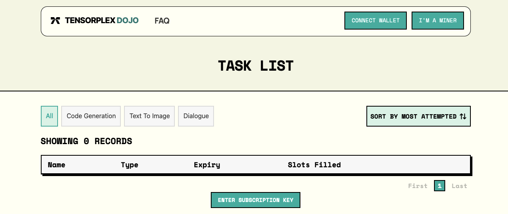
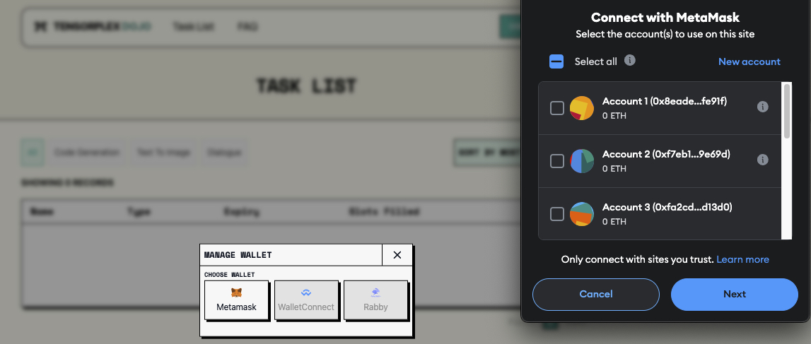
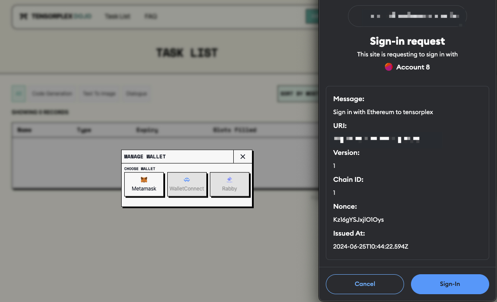
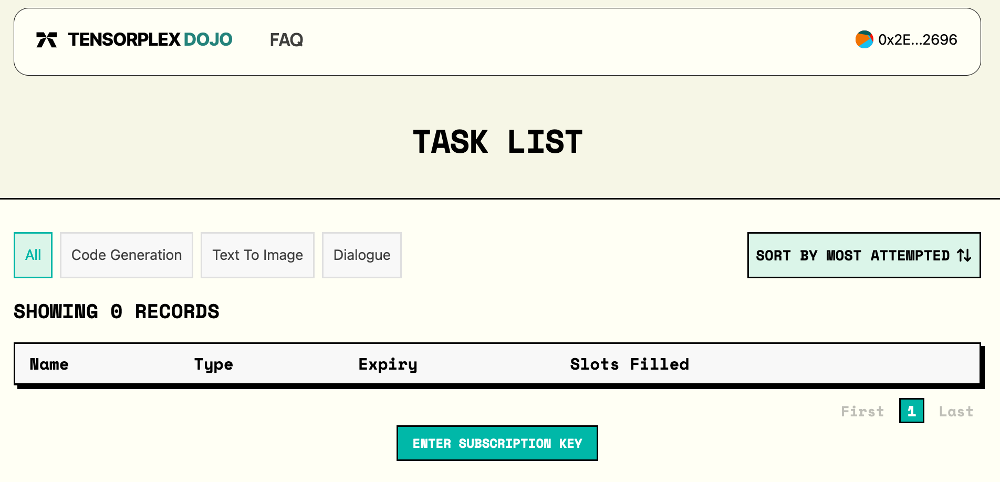
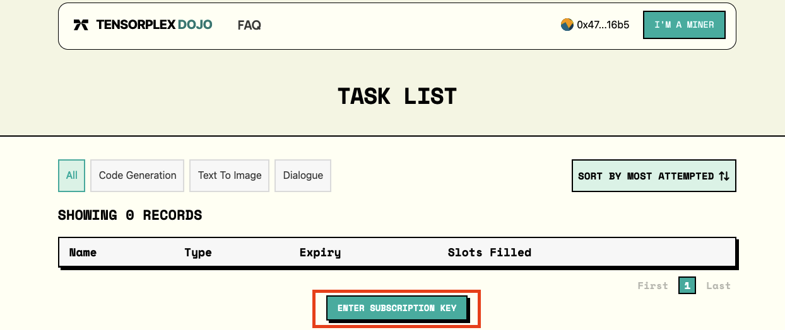
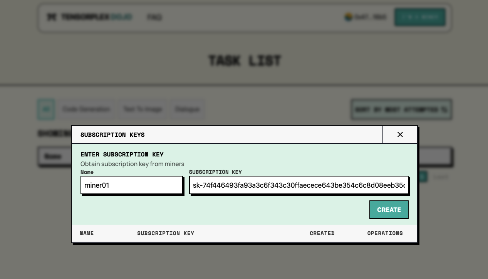
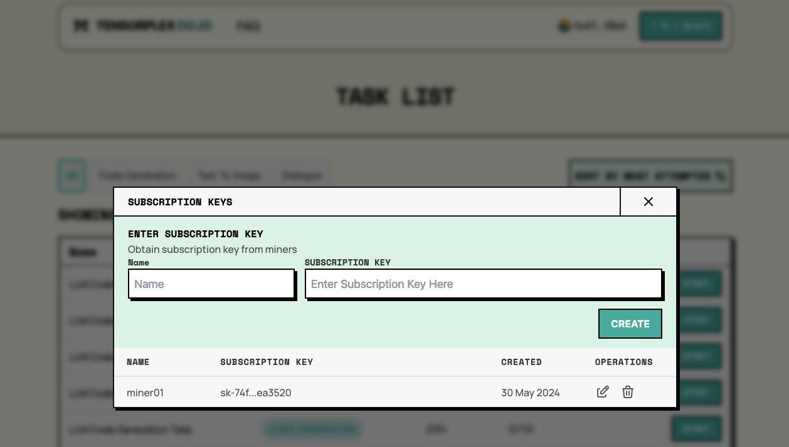
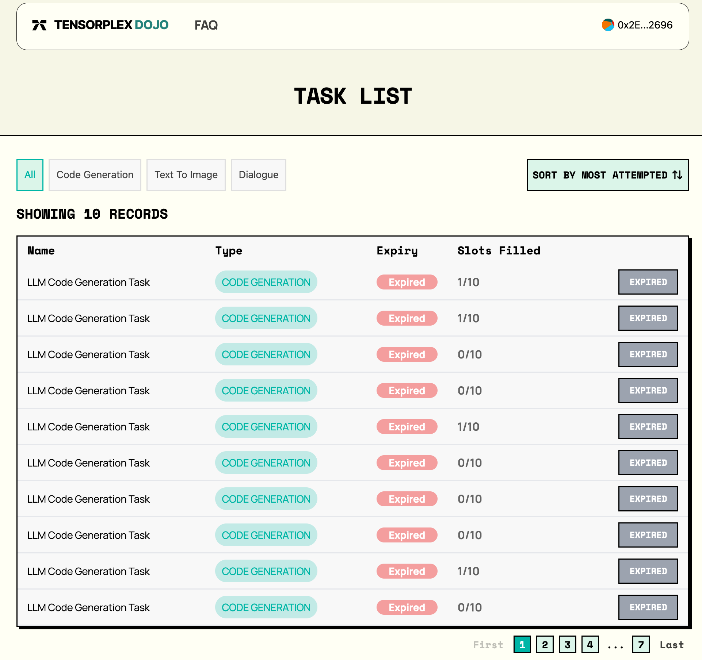

<div align="center">
  
  <h1 style="border-bottom: 0">Dojo Subnet</h1>
</div>

<div align="center">
  <a href="https://discord.gg/p8tg26HFQQ">
    
  </a>
  <a href="https://opensource.org/license/MIT">
    
  </a>
</div>

<br>

<div align="center">
  <a href="https://www.tensorplex.ai/">Website</a>
  ·
  <a href="https://docs.tensorplex.ai/tensorplex-docs/tensorplex-dojo-testnet">Docs</a>
  ·
  <a href="https://docs.tensorplex.ai/tensorplex-docs/tensorplex-dojo-testnet/whitepaper">Whitepaper</a>
  ·
  <a href="https://huggingface.co/tensorplex-labs">HuggingFace</a>
  ·
  <a href="#getting-started">Getting Started</a>
  ·
  <a href="https://twitter.com/TensorplexLabs">Twitter</a>
</div>

---

<details>
<summary>Table of Contents</summary>

- [Introduction](#introduction)
  - [Benefits to participants contributing through Dojo](#benefits-to-participants-contributing-through-dojo)
- [Prerequisites](#prerequisites)
  - [Validator](#validator)
    - [Required Software](#required-software)
    - [System Requirements](#system-requirements)
  - [Miner](#miner)
    - [Required Software](#required-software-1)
    - [System Requirements](#system-requirements-1)
- [Getting Started](#getting-started)
  - [Mining](#mining)
    - [Option 1: Centralised Method](#option-1-centralised-method)
    - [Option 2: Decentralised Method](#option-2-decentralised-method)
    - [Setup Subscription Key for Labellers on UI to connect to Dojo Subnet for scoring](#setup-subscription-key-for-labellers-on-ui-to-connect-to-dojo-subnet-for-scoring)
  - [Validating](#validating)
- [Dojo CLI](#dojo-cli)
- [For Dojo devs](#for-dojo-devs)
- [License](#license)

</details>

---

# Introduction

The development of open-source AI models is often hindered by the lack of high-quality human-generated datasets. Closed-source AI developers, aiming to reduce data collection costs, have created significant social and economic equity challenges, with workers being paid less than $2 per hour for mentally and emotionally taxing tasks. The benefits of these models have been concentrated among a select few, exacerbating inequalities among contributors.

Enter Tensorplex Dojo Subnet — an open platform designed to crowdsource high-quality human-generated datasets. Powered by Bittensor, the Dojo Subnet addresses these challenges by allowing anyone to earn TAO by labeling data or providing human-preference data. This approach democratizes the collection of human preference data, addressing existing equity issues and paving the way for more inclusive and ethical AI development.

Key Features

To ensure the quality and integrity of the data collected, Dojo introduces several novel features:

- Synthetic Task Generation: Unique tasks are generated by state-of-the-art Large Language Models (LLMs) to collect human feedback data, which can be used to improve open-source models.
- Synthetic Ground Truth Validation Mechanism: Validators can synthetically generate partial ground truths, allowing them to determine the quality of responses provided by individual participants.
- Obfuscation: Techniques to prevent sybil attacks and ensure contributions are genuinely human.

Use Cases

The Dojo Subnet offers multiple use cases:

- Synthetically Generated Tasks: These tasks can bootstrap the human participant pool and can be used for model training or fine-tuning from the outset.
- Cross-subnet Validation: Validators can use responses to rate the quality of outputs across other Bittensor subnets, thereby incentivizing miners to improve their performance.
- External Data Acquisition: Entities outside the Bittensor ecosystem can tap into the subnet to acquire high-quality human-generated data.

By creating an open platform for gathering human-generated datasets, Tensorplex Dojo Subnet aims to solve the challenges of quality control, human verification, and sybil attack prevention while promoting a more equitable distribution of benefits in AI development.

## Benefits to participants contributing through Dojo

- Open platform: Anyone capable can contribute, ensuring broad participation and diverse data collection.

- Flexible work environment: Participants enjoy the freedom to work on tasks at their convenience from any location.

- Quick payment: Rewards are streamed consistently to participants, as long as they complete sufficient tasks within a stipulated deadline and have them accepted by the subnet.

<br>

# Prerequisites

## Validator

### Required Software

- pm2
- docker
- openrouter api key
- wandb api key

### System Requirements

- 4 cores
- 8 GB RAM
- 256 SSD

## Miner

### Required Software

- pm2
- docker

### System Requirements

- 2 cores
- 4 GB RAM
- 32GB SSD

# Getting Started

> [!IMPORTANT]
>
> This setup guide uses specific tools to ensure a smooth installation process:
>
> - [fnm](https://github.com/Schniz/fnm) for managing Node.js & npm versions (required for PM2)
> - [Docker](https://docs.docker.com/engine/install/) and [Docker Compose](https://docs.docker.com/compose/)

> Please ensure these prerequisites are installed on your system before proceeding with the installation steps, these are needed by both **validators and miners**.

1. Clone the project, set up and configure python virtual environment

```bash
# In this guide, we will utilize the ~/opt directory as our preferred location.
cd ~/opt

# Clone the project
git clone https://github.com/tensorplex-labs/dojo.git
cd dojo/
```

2. Install PM2, one way is through fnm

```bash
# for linux, a convenience script is available
./dojo/scripts/setup/install_pm2.sh

# for mac/linux (if you do not trust the bash script)
curl -fsSL https://fnm.vercel.app/install | bash
# for windows, choose 1 of the following,
# based on https://github.com/Schniz/fnm?#manually
cargo install fnm
choco install fnm
scoop install fnm
winget install Schniz.fnm

# run any post-install shell setup scripts
# based on https://github.com/Schniz/fnm?#shell-setup

# assuming we are using zsh
echo 'eval "$(fnm env --use-on-cd --shell zsh)"' >> ~/.zshrc
# you can tell what shell you're using by running:
echo $0

# verify fnm installation
fnm --version

# get npm & node, and verify npm installation
fnm install lst/iron && npm --version

# install pm2 and verify installation
npm install -g pm2 && pm2 --version
```

3. Install Docker & Docker Compose

For Docker installation, see https://docs.docker.com/engine/install/ for instructions

For Docker Compose installation, see https://docs.docker.com/compose/install/linux for instructions

```bash
# for linux, a convenience script is available
./dojo/scripts/setup/install_docker.sh

# verify both docker and docker compose are installed
docker --version
docker compose version
```

4. Create your wallets if they aren't created yet

```bash
# run btcli
make btcli
# create your wallets
btcli wallet new_coldkey
btcli wallet new_hotkey
```

5. Get some TAO and ensure you have enough TAO to cover the registration cost

```bash
# for Testnet
btcli s list --subtensor.network test
# output from the `btcli s list ...` command
NETUID    N    MAX_N   EMISSION  TEMPO  RECYCLE        POW       SUDO
 0      128   128.00   0.00%     10    τ1.00000     10.00 M     5C4hrfjw9DjXZTzV3MwzrrAr9P1MJhSrvWGWqi1eSuyUpnhM
...
 98     17    256.00   0.00%     360   τ0.00001  18446744.07 T  5GTAfh3YTcokxWdGc3DgLV5y3hHB4Bs5PQGqw9fEn1WrcwWP
...
```

> [!NOTE]
> the "RECYCLE" column represents the subnet registration cost

7. Register to our subnet

```bash
# register your wallet to our subnet
# Testnet
btcli s register --wallet.name coldkey --wallet.hotkey hotkey --netuid 98 --subtensor.network test
```

## Mining

### Option 1: Centralised Method

1. Create .env file with the following values first.

```bash
# copy .env.miner.example
cp .env.miner.example .env

# ENV's that needs to be filled for miners:
# for testnet
DOJO_API_BASE_URL="https://dojo-api-testnet.tensorplex.ai"
DOJO_API_KEY= # blank for now
WALLET_COLDKEY=# the name of the coldkey
WALLET_HOTKEY=# the name of the hotkey
AXON_PORT=8888 # port to serve requests over the public network for validators to call
```

2. Run the CLI to retrieve API Key and Subscription Key, see [Dojo CLI](#dojo-cli) for usage.

```bash
make btcli
```

3. Complete the .env file with the variables below:

```bash
DOJO_API_BASE_URL="https://dojo-api-testnet.tensorplex.ai"
DOJO_API_KEY=# api key from earlier
```

4. Start the miner by running the following commands:

```bash
# For Testnet
make miner-centralised network=testnet
# for mainnet
make miner-centralised network=mainnet
```

### Option 2: Decentralised Method

1. Create .env file with the following values first.

```bash
# copy .env.miner.example
cp .env.miner.example .env

# ENV's that needs to be filled for miners:
# for testnet
DOJO_API_BASE_URL="http://worker-api:8080" # use this value
DOJO_API_KEY=# blank for now
WALLET_COLDKEY=# the name of the coldkey
WALLET_HOTKEY=# the name of the hotkey
AXON_PORT=8888 # port to serve requests over the public network for validators to call

# for dojo-ui
NEXT_PUBLIC_BACKEND_URL=http://localhost:3000

# for dojo-worker-api
REDIS_USERNAME=
REDIS_PASSWORD=

# postgres details
DB_HOST=postgres-miner:5432 # use this value
DB_NAME=db
DB_USERNAME=
DB_PASSWORD=
DATABASE_URL=postgresql://${DB_USERNAME}:${DB_PASSWORD}@${DB_HOST}/${DB_NAME}

# aws credentials for S3
AWS_ACCESS_KEY_ID=
AWS_SECRET_ACCESS_KEY=
AWS_S3_BUCKET_NAME=
S3_PUBLIC_URL=

JWT_SECRET=# generate a random JWT key
ETHEREUM_NODE=# get an ethereum endpoint URL from Infura
```

2. Start the worker api which will be connected to the CLI later.

```bash
make miner-worker-api
```

3. Run the CLI to retrieve API Key and Subscription Key, see [Dojo CLI](#dojo-cli) for usage.

```bash
make dojo-cli
```

4. Grab the API key and add it to your .env file

```bash
DOJO_API_KEY=# api key from earlier
```

5. Now, run the full miner service.

```bash
# for testnet
make miner-decentralised network=testnet

# read miner logs using the following:
make miner-decentralised-logs network=testnet
```

> [!IMPORTANT]
>
> Don't be alarmed that the status of the `prisma-setup` service shows exit code 0. This means it ran successfully.
>
> Other services should also be healthy in order for the `miner-testnet-decentralised` service to run successfully.

### Setup Subscription Key for Labellers on UI to connect to Dojo Subnet for scoring

Note: URLs are different for testnet and mainnet. Please refer to [docs](https://docs.tensorplex.ai/tensorplex-docs/tensorplex-dojo-testnet/official-links).

TODO guide for decentralised flow

1. Head to https://dojo-testnet.tensorplex.ai and login and sign with your Metamask wallet.

- You'll see an empty homepage with no Tasks, and a "Connect" button on the top right 
- Click on "Connect" and you'll see a popup with different wallets for you to connect to 
- Click "Next" and "Continue", then finally it will be requesting a signature from your wallet, please sign and it will be connected. 
- Once connected, the top navigation bar should display your wallet address. 

2. Once connected, please stay connected to your wallet and click on "Enter Subscription Key". 

- Give your subscription a name, and enter your subscription key generated earlier before running the miner. _*Refer to step 4 of "Getting Started" if you need to retrieve your key*_ 
- Click "Create" and your subscription will be saved. 
- Confirmed your subscription is created properly, and that you can view your tasks! 

## Validating

Copy the validator .env file and set up the .env file

```bash
# copy .env.validator.example
cp .env.validator.example .env

# edit the .env file with vim, vi or nano
# for testnet
DOJO_API_BASE_URL="https://dojo-api-testnet.tensorplex.ai"
WANDB_API_KEY="<wandb_key>"

# for dojo-synthetic-api
OPENROUTER_API_KEY="sk-or-v1-<KEY>"

#postgres details for validator
DB_HOST=postgres-vali:5432
DB_NAME=db
DB_USERNAME=
DB_PASSWORD=
DATABASE_URL=postgresql://${DB_USERNAME}:${DB_PASSWORD}@${DB_HOST}/${DB_NAME}

# Other LLM API providers, Optional or if you've chosen it over Openrouter
TOGETHER_API_KEY=
OPENAI_API_KEY=
```

Start the validator

```bash
# start the validator
# Testnet
make validator network=testnet
```

To start with autoupdate for validators (**optional**)

```bash
# Testnet
pm2 start auto_update.py --name auto-update-validator -- validator

or

pm2 start auto_update.py --name auto-update-miner -- miner
```

# Dojo CLI

We provide a CLI that allows miners to manage their API and subscription keys either when connecting to our hosted Tensorplex API services or their own self-hosted miner backend.

Features:

- Tab completion
- Prefix matching wallets

You may use the dockerized version of the CLI using

```bash
make dojo-cli
```

Alternatively you can simply run the CLI inside of a virtual environment

```bash
# Start the dojo cli tool
# Upon starting the CLI it will ask if you wanna use the default path for bittensor wallets, which is `~/.bittensor/wallets/`.
# If you want to use a different path, please enter 'n' and then specify the path when prompted.
dojo

# TIP: During the whole process, you could actually use tab-completion to display the options, so you don't have to remember them all. Please TAB your way guys! 🙇‍♂️
# It should be prompting you to enter you coldkey and hotkey
# After entering the coldkey and hotkey, you should be in the command line interface for dojo, please authenticate by running the following command.
# You should see a message saying "✅ Wallet coldkey name and hotkey name set successfully."
authenticate

# Afterwards, please generate an API Key with the following command.
# You should see a message saying:  "✅ All API keys: ['sk-<KEY>]". Displaying a list of your API Keys.
api_key generate

# Lastly, please generate a Subscription Key with the following command.
# You should see a message saying:  "✅ All Subscription keys: ['sk-<KEY>]". Displaying a list of your Subscription Keys.
subscription_key generate

# :rocket: You should now have all the required keys, and be able to start mining.

# Other commands available to the CLI:
# You can always run the following command to get your current keys.
api_key list
subscription_key list

# You can also delete your keys with the following commands.
api_key delete
subscription_key delete
```

# For Dojo devs

You most likely won't be running a dockerized version of the subnet code as you ship. Use the following guide to get up and running

1. Get uv

```bash
curl -LsSf https://astral.sh/uv/install.sh | sh
```

2. Make sure you have a python version >=3.10

```bash
uv python list
```

3. Create a virtualenv

```bash
# i'm using 3.11 here, but you may use any >=3.10 version
uv venv dojo_venv --python=$(uv python find 3.11)
# if you wish to follow
```

4. Activate virtualenv

```bash
# follows python-venv syntax
source dojo_venv/bin/activate
```

# License

This repository is licensed under the MIT License.

```text
# The MIT License (MIT)
# Copyright © 2023 Yuma Rao

# Permission is hereby granted, free of charge, to any person obtaining a copy of this software and associated
# documentation files (the "Software"), to deal in the Software without restriction, including without limitation
# the rights to use, copy, modify, merge, publish, distribute, sublicense, and/or sell copies of the Software,
# and to permit persons to whom the Software is furnished to do so, subject to the following conditions:

# The above copyright notice and this permission notice shall be included in all copies or substantial portions of
# the Software.

# THE SOFTWARE IS PROVIDED "AS IS", WITHOUT WARRANTY OF ANY KIND, EXPRESS OR IMPLIED, INCLUDING BUT NOT LIMITED TO
# THE WARRANTIES OF MERCHANTABILITY, FITNESS FOR A PARTICULAR PURPOSE AND NONINFRINGEMENT. IN NO EVENT SHALL
# THE AUTHORS OR COPYRIGHT HOLDERS BE LIABLE FOR ANY CLAIM, DAMAGES OR OTHER LIABILITY, WHETHER IN AN ACTION
# OF CONTRACT, TORT OR OTHERWISE, ARISING FROM, OUT OF OR IN CONNECTION WITH THE SOFTWARE OR THE USE OR OTHER
# DEALINGS IN THE SOFTWARE.
```
